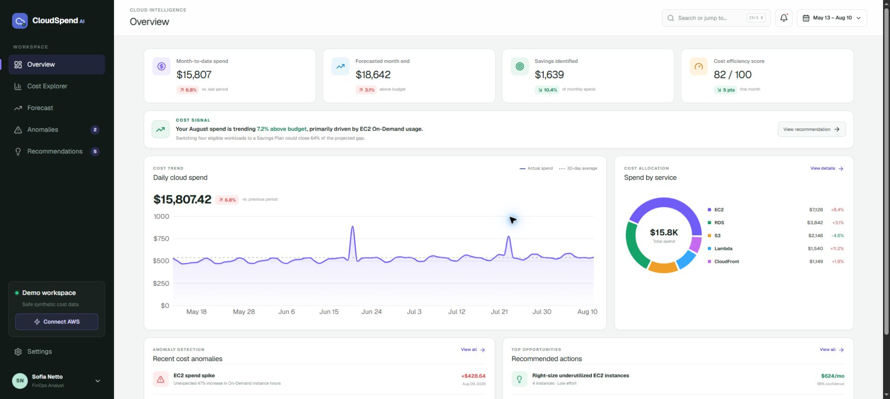
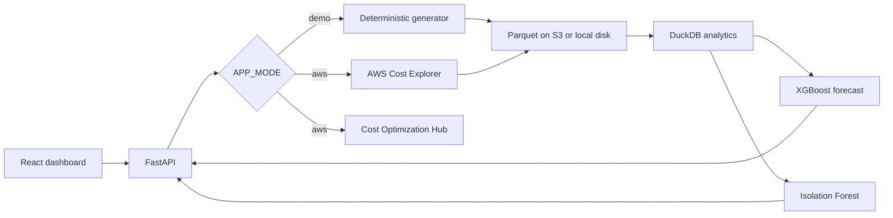

# CloudSpend AI

**AWS FinOps Intelligence Platform for cost visibility, 30-day forecasting, anomaly detection, and prioritized savings.**

[](https://github.com/Sofiabns/cloudspend-ai/actions/workflows/ci.yml)
[](LICENSE)
[](backend/pyproject.toml)
[](package.json)



CloudSpend AI turns fragmented AWS billing data into decisions. It was designed around three questions FinOps and engineering teams face every month:

1. **Where is the money going?** Drill into spend by service, region, and account.
2. **What will the next month cost?** Compare a 30-day forecast and confidence interval against the budget.
3. **What should we act on first?** Rank anomalies and optimization opportunities by impact and effort.

The public experience uses a deterministic synthetic dataset, so anyone can evaluate the complete product without an AWS account. An optional private AWS mode uses the standard `boto3` credential chain and read-only Billing permissions. Credentials never pass through the browser or enter this repository.

## Product capabilities

| Area | What the product delivers |
| --- | --- |
| Overview | Current spend, monthly forecast, savings potential, and top cost drivers |
| Cost Explorer | Daily cost evolution with period, service, region, and account filters |
| Forecast | XGBoost forecast, 90% prediction interval, budget comparison, and baseline metrics |
| Anomalies | Ranked spikes with estimated impact, severity, and likely contributing dimension |
| Recommendations | Savings opportunities prioritized by monthly value and implementation effort |

## Engineering evidence

- **Data:** 12 months of reproducible multi-account AWS cost data stored as Parquet and queried with DuckDB.
- **Machine learning:** XGBoost with trend, calendar, lag, and rolling features; seasonal-naive baseline; rolling backtesting; MAE, RMSE, and MAPE.
- **Explainability:** Isolation Forest signals are enriched with service, region, cost delta, impact, severity, and a human-readable cause.
- **Backend:** versioned FastAPI endpoints, OpenAPI documentation, adapter contracts, and AWS responses tested with mocks.
- **Cloud:** Docker Compose for local parity and Terraform for CloudFront, S3, API Gateway, Lambda, EventBridge, and least-privilege IAM.
- **Delivery:** GitHub Actions runs linting, web and API tests, secret scanning, and Terraform validation.

## Architecture



The AWS deployment uses CloudFront and a private S3 origin for the web app, API Gateway and a Lambda container for the API, a versioned S3 data bucket, EventBridge refreshes, and least-privilege IAM.

## Model evaluation

The included deterministic demo run produces approximately:

| Metric | XGBoost | Seasonal baseline |
| --- | ---: | ---: |
| MAPE | 4.5% | 5.1% |
| MAE | $29.3 | — |
| RMSE | $60.0 | — |

The exact values can vary slightly by dependency version. When fewer than 60 daily observations are available, the API explicitly falls back to the seasonal baseline.

The evaluation uses rolling time-based backtesting to preserve temporal order and avoid future-data leakage. Prediction intervals are estimated from backtest residuals. When fewer than 60 daily observations are available, the API explicitly falls back to the seasonal baseline.

## Quick start

### One command

```bash
docker compose up --build
```

- Dashboard: `http://localhost:3000`
- API documentation: `http://localhost:8000/docs`

### Development

```bash
npm install
npm run dev
```

```bash
cd backend
python -m venv .venv
# Windows: .venv\Scripts\activate
# macOS/Linux: source .venv/bin/activate
pip install -r requirements-dev.txt
uvicorn app.main:app --reload
```

Copy `.env.example` to `.env` only when overriding local defaults. Demo mode is enabled by default.

## AWS mode

1. Enable Cost Explorer. Cost Optimization Hub is optional and can take up to 24 hours to populate recommendations.
2. Attach the policy in [`docs/iam-readonly-policy.json`](docs/iam-readonly-policy.json) to a dedicated role or local profile.
3. Configure credentials through the normal AWS credential chain.
4. Start the API with `APP_MODE=aws`.

Do not put access keys in `.env`, frontend variables, Docker images, or GitHub. The hosted public demo always uses `APP_MODE=demo`.

## API

| Endpoint | Purpose |
| --- | --- |
| `GET /api/v1/health` | Service health and active data mode |
| `GET /api/v1/overview` | Executive KPIs and service allocation |
| `GET /api/v1/costs` | Daily costs grouped by service, region, or account |
| `GET /api/v1/forecast?horizon=30` | Forecast, confidence interval, and model metrics |
| `GET /api/v1/anomalies` | Ranked explainable anomalies |
| `GET /api/v1/recommendations` | Prioritized monthly and annual savings |

## Tests and quality gates

```bash
npm run lint
npm test

cd backend
ruff check app tests
pytest --cov=app
```

The backend suite covers API behavior, aggregation dimensions, prediction intervals, synthetic anomaly discovery, recommendations, and mocked AWS service contracts. The web suite verifies the rendered application shell and recruiter-facing product states. CI also validates Terraform and scans the Git history for secrets.

## Repository structure

```text
cloudspend-ai/
├── app/                    # React product interface
├── backend/app/            # FastAPI, adapters, analytics, and ML services
├── backend/tests/          # API, ML, and mocked AWS contract tests
├── docs/                   # Screenshot and read-only IAM policy
├── infra/terraform/        # Reproducible AWS infrastructure
├── tests/                  # Web rendering tests
├── .github/workflows/      # CI and security checks
└── docker-compose.yml      # One-command local environment
```

## Infrastructure

The deployment definition lives in `infra/terraform`. It expects an immutable Lambda container image URI:

```bash
terraform init
terraform plan -var="lambda_image_uri=<account>.dkr.ecr.us-east-1.amazonaws.com/cloudspend-ai:<sha>"
```

Review the plan before applying it; CloudFront, Lambda, API Gateway, S3, and Cost Management API usage can incur AWS charges.

## Responsible demo data

- No customer billing records are included.
- The synthetic generator uses a fixed seed, trend, weekly/monthly seasonality, account allocation, and labeled cost spikes.
- Recommendations are illustrative in demo mode and sourced from Cost Optimization Hub only in AWS mode.

## Design decisions and trade-offs

- **Safe public demo:** synthetic costs provide a realistic product walkthrough without exposing billing data or requiring credentials.
- **Adapter boundary:** demo and AWS providers share the same interface, keeping the analytics and API layers independent of the data source.
- **Baseline before complexity:** XGBoost is accepted only when it improves on the seasonal baseline; limited histories use the simpler model.
- **Server-side credentials:** AWS access remains in a trusted backend and follows the default credential chain instead of custom key handling.

## Roadmap

- Add configurable currencies while keeping USD as the canonical analytical value.
- Persist model artifacts and data-quality checks for scheduled refreshes.
- Add richer cost-allocation tags and business-unit reporting.
- Publish an authenticated sandbox for private AWS account evaluations.

## License

[MIT](LICENSE) © 2026 Sofia Bueris Netto de Souza
